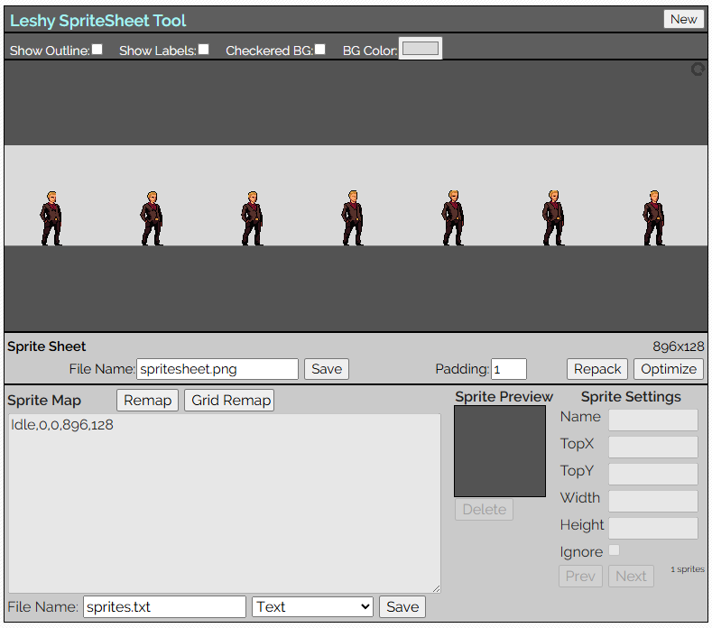
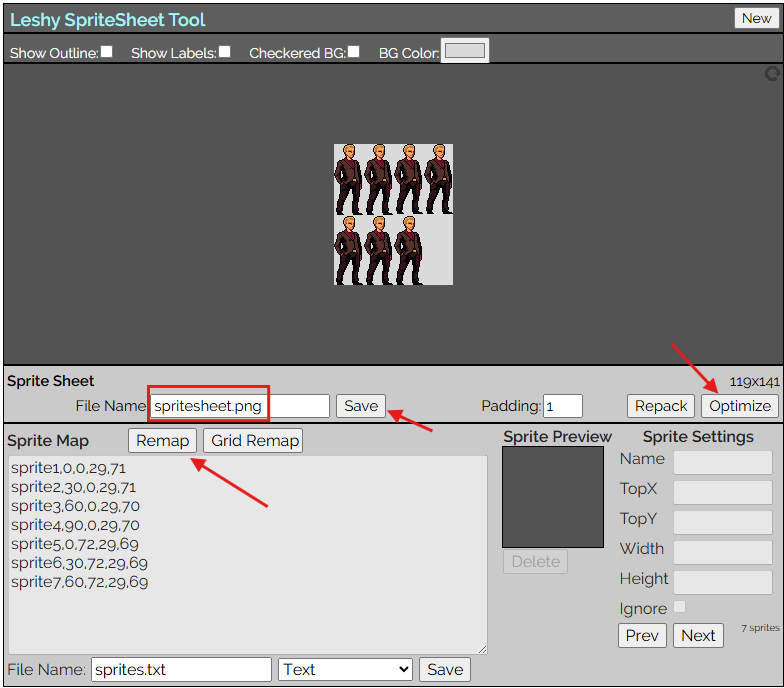
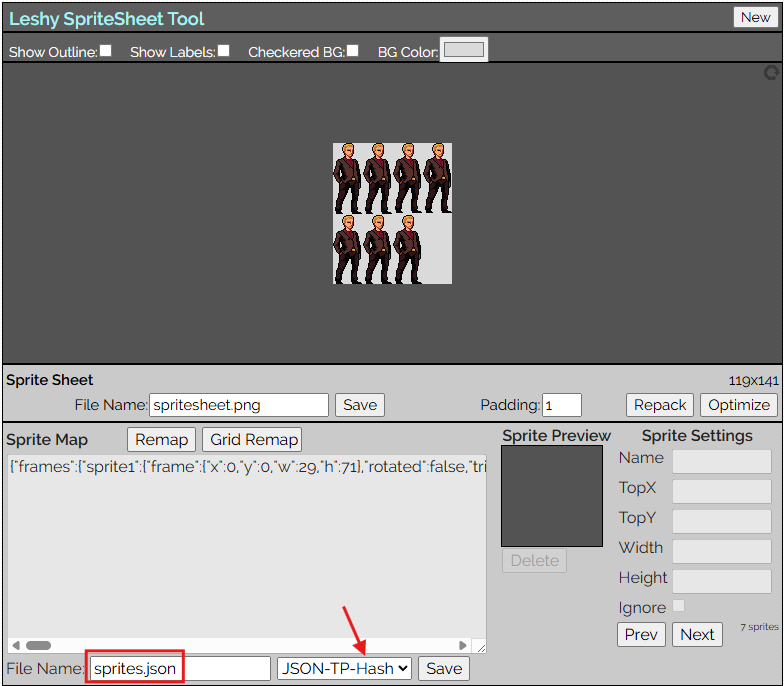

# UTUGameDev2025

## Clonar desde GIT

- Al Ejecutar Pycharm seleccionar "Clone Repository" (arriba a la derecha)
- Ingresar la URL: https://github.com/exinosURU/UTUGameDev2025 y seleccionar el directorio destino en la PC.
- Seleccionar en "Clone"

## Configuración ambiente (en caso de ser necesario)

- En la raiz UTUGameDev2025 ejecutar:
  
```
  python -m venv .venv

  pip install -r requirements.txt
```

- File / Settings / Python / Interpreter / Add Interpreter / Add local interpreter / Select existing -> Type: Python, y en el path el que se tenga instalado.


## Generación de Atlas

1. Acceder a https://www.leshylabs.com/apps/ y seleccionar SpriteSheet Tool
2. Arrastrar y soltar las imágenes que se quieran en el atlas. <br>
 <br>
3. Seleccionar _Remap_, _Optimize_ y finalmente guardar el nuevo spritesheet.<br>
<br>
4. Finalmente elegir el formato de salida (JSON-TP-Hash) y guardar el atlas.<br>
<br>
5. Se descargará un archivo JSON con el atlas (estará en una sola línea, se puede utilizar cualquier IDE para identarlo de una manera mas legible).<br>


